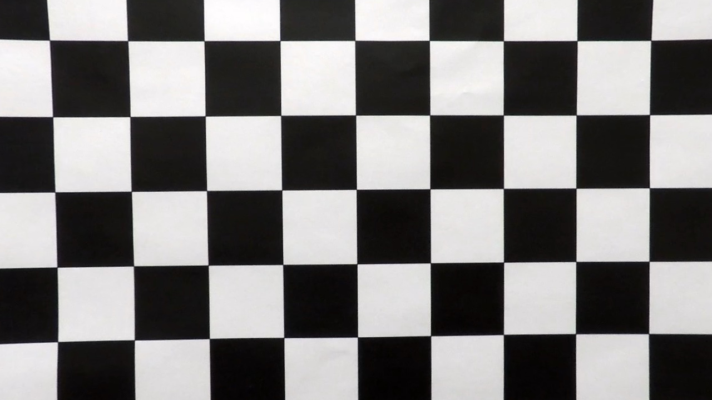

<<<<<<< HEAD
## Writeup
=======
## Advanced Lane Finding

In this project, your goal is to write a software pipeline to identify the lane boundaries in a video, but the main output or product we want you to create is a detailed writeup of the project.  Check out the [writeup template](https://github.com/udacity/CarND-Advanced-Lane-Lines/blob/master/writeup_template.md) for this project and use it as a starting point for creating your own writeup.  

Creating a great writeup:
>>>>>>> 92d13c19d7812954c3f9a57f029cfdaf8a057484
---

**Advanced Lane Finding Project**

The goals / steps of this project are the following:

* Compute the camera calibration matrix and distortion coefficients given a set of chessboard images.
* Apply a distortion correction to raw images.
* Use color transforms, gradients, etc., to create a thresholded binary image.
* Apply a perspective transform to rectify binary image ("birds-eye view").
* Detect lane pixels and fit to find the lane boundary.
* Determine the curvature of the lane and vehicle position with respect to center.
* Warp the detected lane boundaries back onto the original image.
* Output visual display of the lane boundaries and numerical estimation of lane curvature and vehicle position.

### Camera Calibration

#### 1. Briefly state how you computed the camera matrix and distortion coefficients. Provide an example of a distortion corrected calibration image.

The code for this step is contained in the first code cell of the Jupyter notebook Advanced-Lane-Lines.ipynb. I started by setting `objpoints`. Then I changed the color of images (calibration*.jpg) to gray in order to use `cv2.findCHessboardCorners()` function to get corners. Lastly I used `cv2.drawChessboardCorners()` to draw corners. I found that some images (calibration*.jpg) don't have enough corners, so the ret returned false. 

I used corners as my `imgpoints` and used `cv2.calibrateCamera` to compute the camera calibration and distortion coefficients. I applied the coefficients by using undistort function to get undistorted images.
 

### Pipeline (single images)

#### 1. Provide an example of a distortion-corrected image.

To demonstrate this step, I will describe how I apply the distortion correction to one of the test images like this one:
distorted image

undistorted image

#### 2. Describe how (and identify where in your code) you used color transforms, gradients or other methods to create a thresholded binary image.  Provide an example of a binary image result.

Firsly, I changed the color of image to HLS and RGB, and I applied sobel for x direction. Since S channel can detect shadow easily, I used operator & to combine S channel and channel L to remove the tree shadow. And I used operator | to combine it with R channel, H channel and sobel x direction to strengthen lines.

 Here's an example of my output for this step.  (note: this is not actually from one of the test images. This image is from project video around 45 seconds. You can see, there is tree shadow. )
S channel

Combined image

#### 3. Describe how (and identify where in your code) you performed a perspective transform and provide an example of a transformed image.
First I created the function `region_of_interest()` to mask the image. The area is [(200,720),(600,425),(700,425),(1150,720)]. Then I transformed the perspective of image.
The code for my perspective transform includes a function called `warper()` the fifth code cell of Jupyter notebook Advanced-Lane-Lines.ipynb. The `warper()` function takes as inputs an image (img), as well as source (src) and destination (dst) points. I chose the following points as my source and destination points:

| Source        | Destination   | 
|:-------------:|:-------------:| 
| 300, 720      | 400, 720      | 
| 1080, 720     | 900, 720      |
| 720, 450      | 900, 0        |
| 600, 450      | 400, 0        |

I verified that my perspective transform was working as expected by drawing the `src` and `dst` points onto a test image and its warped counterpart to verify that the lines appear parallel in the warped image.
warpedimg

#### 4. Describe how (and identify where in your code) you identified lane-line pixels and fit their positions with a polynomial?

I made the function `find_lane_pixels()` in Jupyter notebook Advanced-Lane-Lines.ipynb. It can divide the image into nine parts from bottom to top. Then it searches the peak points of lower halves of histogram as its base points. After that, the  function uses base points to search new points in the area of next part for y axis and ±margin(50) for x axis. And it uses average point of new points as its new base points. The function does this way continuously until it finishes searching in all parts.

I also made the function `fit_polynomial()`. I applied points it found and use `np.polyfit()` to fit their positions.

The function `search_around_poly()` was made to search new points basing on the lines detected last time with margin 50. So `find_lane pixels()` is for the first time search and `search_around_poly()` is used when the lines have already been detected by `find_lane pixels()`

I also defined a function `judge()` to judge if the difference of fit is too big. If it is, it will use average fit and do the function `find_lane_pixel` to search points next time.
find_lane_pixels

search_around_poly

#### 5. Describe how (and identify where in your code) you calculated the radius of curvature of the lane and the position of the vehicle with respect to center.

I made a function `measure_curvature_position_real()` to do this in Jupyter notebook Advanced-Lane-Lines.ipynb. I used points which were detected by `fin_lane_pixels()` or `search_around_poly()` functions to obtain `left_fit_cr` and `right_fit_cr`. Then I calculated the curvatures of left line and the right line. And I used average of curvatures as the curvature of the lane.

I used x coordinates of right line and left line which were predicted at bottom of the image and used the difference of midpoint of these two poins and the midpoint of the image as the position of the vehicle.

#### 6. Provide an example image of your result plotted back down onto the road such that the lane area is identified clearly.

I implemented this step in in the function `draw(binary_warped, left_fit, right_fit)`in Jupyter notebook Advanced-Lane-Lines.ipynb.  Here is an example of my result on a test image:
lane

---

### Pipeline (video)

#### 1. Provide a link to your final video output.  Your pipeline should perform reasonably well on the entire project video (wobbly lines are ok but no catastrophic failures that would cause the car to drive off the road!).

 [link to my video result](./project_video_output.mp4)

---

### Discussion

#### 1. Briefly discuss any problems / issues you faced in your implementation of this project.  Where will your pipeline likely fail?  What could you do to make it more robust?

Firstly, my code didn't work well for the second shadow of the project video. So I made the function `region of interet()` to mask the image. I also created `judge()` function to select search methond automatically, because I thought that search methond might be not good enough. However, both of them didn't work well. So I checked the video one frame by one frame. I realized that the root cause is that I combined S channel and R channel. Although S channel can detect lane lines well, it also detected tree shadow. The tree shadow affected the functions `find_lane_pixels()` and `search_around_poly()` to search lines. Therefore,  I used operator & to combine S channel and channel L to remove the tree shadow. And I used operator | to combine it with R channel, H channel and sobel x direction to strengthen lines.

Currently my code works well with the project video, but for the challenge video, I met some setbacks. Threshold binary image was created by my code didn't have clear lines especially for left line. Additionally, when the vehicle goes through the tunnel, `find_lane_pixels()` and `search_around_poly()` cannot find any points in the lower half of the image, so the error came out. I think if I change the threhold value or the method to get binary image, it will be more robust.